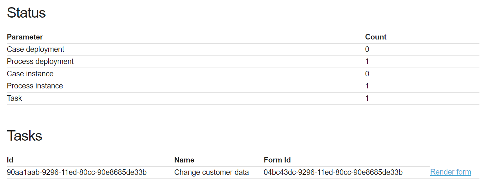
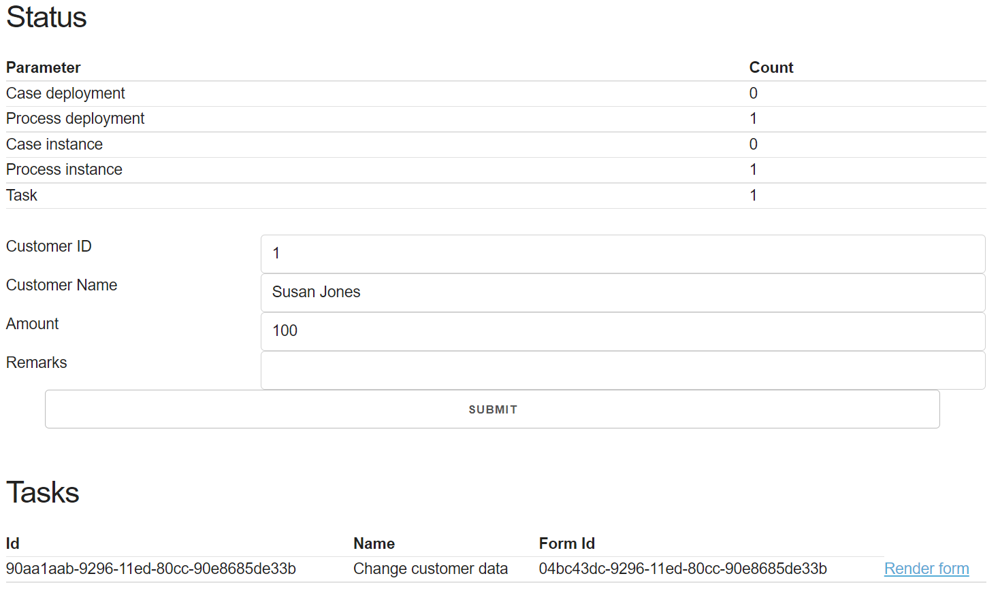

Extended Flowable Event Registry Demo
=====================================

This project is a Spring Boot which contains an implementation of a simple Flowable 6.8.0 event registry process.
It demonstrates how you can listen to events from a [Kafka](https://kafka.apache.org/) topic, change the event data 
with a user action and send the changed data to another [Kafka](https://kafka.apache.org/) topic. 
We have focused on [Kafka](https://kafka.apache.org/) in this project.


We have used the Open Source version of Flowable UI to generate the forms and diagrammes 
which we downloaded from [here](https://www.flowable.com/open-source-download).

In this project we are also using the Open Source [Flowable REST API's](https://www.flowable.com/open-source/docs/bpmn/ch15-REST) 
which allow to render and submit the user task form data.

And we also created a small dashboard and a simplistic Flowable form renderer using a couple of Vanilla Javascript functions. 

**Notes**
  - This is my first Flowable project, so there might be some bad practices in place. If you find some problem,
  please let me know.
  - I have based this project on https://github.com/seletz/flowable-event-registry-demo and extended it.

Prerequisites
-------------

- Use a `Java 11 JDK` or later (we have used Java 18)
- Install `Maven` (we have used Maven 3.8.3)
- A Kafka installation on localhost

Nice to Have
------------

- Some sort of Kafka client. I have used a Docker image of Kafka UI: [provectuslabs/kafka-ui:latest](https://github.com/provectus/kafka-ui)
  which I ran in a Docker container

Example Use Case
----------------

Let's assume we have some system which sends messages to a Kafka topic which are JSON encoded and
looks like this:

```
{
	"eventKeyValue": "myEvent",
	"customerName": "John Smith",
	"customerId": "1",
	"amount": 5
}
```

We want flowable to look for **events -- e.g. myEvent** of this kind and start a business process for each
message / event.

After the Kafka event is consumed it is sent for review via a user task, with which you can change the original data 
and add remarks.

After you have submitted the form associated to the user task the submitted data is sent to another Kafka queue:
`customer-outbound`

The outbound messages will look like this:

```
{
	"customerName": "John Smith",
	"amount": 5,
	"customerId": "1",
	"remarks": "John Smith is a regular customer. "
}
```

Testing
-------

- make sure Kafka is running
- Start the application
- Using the Kafka UI:
    - navigate to the "customers" queue
    - publish a message in the format specified above
    
You should see something like this in the logs:

    2023-01-12 12:58:54.314  INFO 47252 --- [stChannel-0-C-1] c.o.e.flowableeventregistry.Logger       : LOG: Process eventTest3:1:d0d05bf3-9278-11ed-beed-90e8685de33b activity theTask: John Smith - 5
    2023-01-12 12:58:54.315 DEBUG 47252 --- [stChannel-0-C-1] c.o.e.flowableeventregistry.Logger       : LOG: var amount := 5
    2023-01-12 12:58:54.315 DEBUG 47252 --- [stChannel-0-C-1] c.o.e.flowableeventregistry.Logger       : LOG: var customerId := 1
    2023-01-12 12:58:54.315 DEBUG 47252 --- [stChannel-0-C-1] c.o.e.flowableeventregistry.Logger       : LOG: var customerName := John Smith
    2023-01-12 12:58:54.315 DEBUG 47252 --- [stChannel-0-C-1] c.o.e.flowableeventregistry.Logger       : LOG: var eventInstance := org.flowable.eventregistry.impl.runtime.EventInstanceImpl@3b1b202a

- Open the dashboard on http://localhost:8090/flowable/dashboard
  - You should see the count of process and task instance set to **1**
  - You should also see the task ID with its form ID on the dashboard page



- Now click on the render form and the form will be rendered on the page:



- Now you can change the data in the form and submit it. After a successful submission the changed record will be sent to
the Kafka `customer-outbound` topic and the page will be refreshed

What Does the Code Do?
----------------------

- Define a Kafka **inbound channel**  -- `inbound.channel` in resources/eventregistry
- Define the **inbound event** -- `event-one.event` in resources/eventregistry
- Define a Kafka **outbound channel**  -- `channel-customerOutboundChannel.channel` in resources/eventregistry
- Define the **outbound event** -- `event-customerOutboundEvent.event` in resources/eventregistry
- Define a **process** -- `event-test-process.bpmn20.xml` in resources/processes
- Define a **form** -- `customerDetails.form` in resources/forms

### Inbound Channel

Defines a channel where the Flowable engine listens for events.

- It's a "inbound" channel -- messages flow from the queue to Flowable
- We use Kafka
- Our messages are JSON
- The messages we receive have a JSON Field "eventKeyValue" which defines the event type. See above for more information.
- the event type is "myEvent" for the example message.
- We want flowable to bind to the queue `customers`.  This is a queue which must exist in Kafka and
  our messages must be routed to this queue.

Inbound channel definition:

```json
{
  "type": "kafka",
  "channelType": "inbound",
  "deserializerType": "json",
  "topics": [
    "customers"
  ],
  "channelEventKeyDetection": {
    "jsonField": "eventKeyValue"
  },
  "key": "testChannel",
  "category": "channel",
  "name": "Test channel",
  "description": "test Inbound Channel"
}
```

### Inbound Event Definition

This defines the shape of the message and a binding to the inbound channel.

Here is the full definition:

    {
      "key": "myEvent",
      "name": "My event",
      "inboundChannelKeys": [
        "test-channel"
      ],
      "correlationParameters": [
        {
          "name": "customerId",
          "type": "string"
        }
      ],
      "payload": [
        {
          "name": "customerName",
          "type": "string"
        },
        {
          "name": "foo",
          "type": "string"
        },
        {
          "name": "amount",
          "type": "integer"
        }
      ]
    }

### Form

We have a simple form definition which was created with Flowable UI v. 6.8.0. The form definition contains the 
following fields:

- customerId
- customerName
- amount
- remarks

The form definition is contained in [this file](src/main/resources/forms/customerDetails.form).

This is how the form looks in the designer:


### Outbound Channel

The outbound channel is defined to send messages to a specific Kafka topic.

This is the channel definition:

```json
{
  "type": "kafka",
  "channelType": "outbound",
  "serializerType": "json",
  "topic": "customer-outbound",
  "name": "Customer Outbound Channel",
  "key": "customerOutboundChannel"
}
```

### Outbound Event Definition

The outbound event defines the payload of the event and to which channel it is associated.

This the event definition:

```json
{
  "correlationParameters": [
    {
      "name": "customerId",
      "type": "string"
    }
  ],
  "payload": [
    {
      "name": "customerId",
      "type": "string"
    },
    {
      "name": "customerName",
      "type": "string"
    },
    {
      "name": "amount",
      "type": "integer"
    },
    {
      "name": "remarks",
      "type": "string"
    }
  ],
  "name": "Sentiment Analysis Event",
  "key": "customerAnalysisEvent",
  "outboundChannelKeys": [
    "customerOutboundChannel"
  ]
}
```

### Process

So finally we define a BPMN process.


- The **startEvent** refers to our event type `myEvent`
- We define two mappings from event payload to business process variable:
  - customerName -> customerName
  - amount -> amount
  - customerId -> customerId
- The script task uses the Logger bean to log a message. (`theTask`)
- Then we have a user task which is associated to the form (`changeCustomerData`)
- This task is followed by another logging task (`log2`)
- Finally we send a message to Kafka `sendAndReceiveEventTask1`

      <process id="eventTest3" name="Process to test events 4" isExecutable="true">
          <startEvent id="theStart" isInterrupting="true">
              <extensionElements>
                  <flowable:eventType xmlns:flowable="http://flowable.org/bpmn"><![CDATA[myEvent]]></flowable:eventType>
                  <flowable:eventOutParameter xmlns:flowable="http://flowable.org/bpmn" source="customerName" sourceType="string" target="customerName"></flowable:eventOutParameter>
                  <flowable:eventOutParameter xmlns:flowable="http://flowable.org/bpmn" source="amount" sourceType="integer" target="amount"></flowable:eventOutParameter>
                  <flowable:eventOutParameter xmlns:flowable="http://flowable.org/bpmn" source="customerId" sourceType="string" target="customerId"></flowable:eventOutParameter>
              </extensionElements>
          </startEvent>
          <sequenceFlow id="flow1" sourceRef="theStart" targetRef="theTask"></sequenceFlow>
          <serviceTask id="theTask" name="log1" flowable:expression="#{Logger.log(execution, customerName, amount)}"></serviceTask>
          <endEvent id="theEnd"></endEvent>
          <serviceTask id="sendAndReceiveEventTask1" name="Send to Kafka" flowable:type="send-event">
              <extensionElements>
                  <flowable:eventType><![CDATA[customerAnalysisEvent]]></flowable:eventType>
                  <flowable:eventInParameter sourceExpression="${customerName}" target="customerName" targetType="string"></flowable:eventInParameter>
                  <flowable:eventInParameter sourceExpression="${amount}" target="amount" targetType="integer"></flowable:eventInParameter>
                  <flowable:eventInParameter sourceExpression="${customerId}" target="customerId" targetType="string"></flowable:eventInParameter>
                  <flowable:eventInParameter sourceExpression="${remarks}" target="remarks" targetType="string"></flowable:eventInParameter>
                  <flowable:channelKey xmlns:flowable="http://flowable.org/bpmn"><![CDATA[customerOutboundChannel]]></flowable:channelKey>
              </extensionElements>
          </serviceTask>
          <userTask id="changeCustomerData" name="Change customer data" flowable:formKey="customerDetails" flowable:formFieldValidation="true">
              <extensionElements>
                  <flowable:formProperty id="customerId" name="Customer Id" type="string" expression="${customerId}" variable="customerId"></flowable:formProperty>
                  <flowable:formProperty id="customerName" name="Customer Name" type="string" expression="${customerName}" variable="customerName"></flowable:formProperty>
                  <flowable:formProperty id="amount" name="amount" type="string" expression="${amount}" variable="amount"></flowable:formProperty>
              </extensionElements>
          </userTask>
          <sequenceFlow id="flow2" sourceRef="theTask" targetRef="changeCustomerData"></sequenceFlow>
          <serviceTask id="sid-28848843-5EE0-41CA-88A4-E4985484E48D" name="log2" flowable:expression="#{Logger.log(execution)}"></serviceTask>
          <sequenceFlow id="sid-A62FD212-B007-475D-BCF1-00ECA0CB68BE" sourceRef="sendAndReceiveEventTask1" targetRef="theEnd"></sequenceFlow>
          <sequenceFlow id="sid-4F3283B8-AA9D-4482-BF0C-2738206F67D5" sourceRef="sid-28848843-5EE0-41CA-88A4-E4985484E48D" targetRef="sendAndReceiveEventTask1"></sequenceFlow>
          <sequenceFlow id="sid-1A06C9DA-6918-4871-9805-942DC4E15AC7" sourceRef="changeCustomerData" targetRef="sid-28848843-5EE0-41CA-88A4-E4985484E48D"></sequenceFlow>
      </process>

### Important Flowable REST Interfaces 

We have used a set of Flowable REST interfaces to interact with the Flowable engine. Here are the most relevant ones:

#### Tasks

- List all tasks
  
  GET http://localhost:8090/flowable/process-api/runtime/tasks

- List specific task
  
  GET http://localhost:8090/flowable/process-api/runtime/tasks/@task-id@
  
  Example: GET http://localhost:8090/flowable/process-api/runtime/tasks/d3132791-929a-11ed-80cc-90e8685de33b

#### Forms

- List all form definitions
  
  GET http://localhost:8090/flowable/form-api/form-repository/form-definitions

- List a specific form definition
  
  GET http://localhost:8090/flowable/form-api/form-repository/form-definitions/@form-definition-id@
  
  Example: GET http://localhost:8090/flowable/form-api/form-repository/form-definitions/f2994b26-9027-11ed-9ce7-90e8685de33b

- View all forms associated with a task 

  GET http://localhost:8090/flowable/process-api/runtime/tasks/@task-id@/form

- View historic task instances

  GET http://localhost:8090/flowable/process-api/history/historic-task-instances/@task-id@/form

#### How to Explore the REST Interfaces

The Flowable API is quite extensive and so we used the Spring Boot Actuator package to explore the API's. The Maven
dependency is this one:

```xml
<dependency>
    <groupId>org.springframework.boot</groupId>
    <artifactId>spring-boot-starter-actuator</artifactId>
</dependency>
```

You get access to the REST API mappings in the application via:

http://localhost:8090/flowable/actuator/mappings


